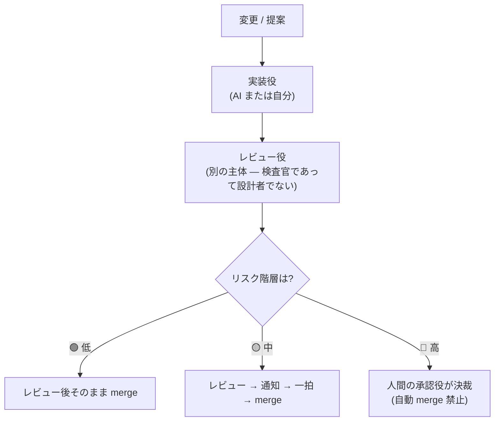

# The Qorum Method（日本語版）

> すべての merge には、定足数（quorum）が要る。
> AIに任せる時代の、軽量な意思決定ガバナンス。AIに実装させ、AIにレビューさせていい。でも、何を通してよいかは、リスク別に決める。

**Qorum であって、quorum ではない。** 合議（consensus）は仕組みにすぎず、目的は統治（governance）です。綴りを一つ落としているのは意図的——これは「AI同士を合意させる」話ではなく、「変更ごとに、どこまで任せていいかをリスクで決める」話だから。

これは英語の正本 [README.md](README.md) を日本語で書き直した、日本語の正本級ドキュメントです。直訳ではありません。

---

## これは何か

ひとことで言うと、**「AIに何を任せるか」ではなく「AIに何を決めさせないか」を先に決める方法**です。

実装役・レビュー役・承認役の3つに分け、変更や判断を**リスクで3段階に分ける**。低リスクはそのまま流し、高リスクは人間に戻す。これだけです。

## 問題

AIと速く進めるほど、二つの失敗が絡み合います。

ひとりで動いていると、レビューしてくれる相手がいません。「自分のPRは自分で見ればいい」は、誰もが持っていると言い張り、夜11時には誰も守れない規律です。

かといって、AIに全部承認させるのは、レビューがない状態より危険です。**何でも通すレビュー役は、レビューの"実体"なしに"安心"だけを作る**から。CIの設定も、秘密鍵の扱いも、千行のリファクタも、AIは自信たっぷりに「OK」と言います。

第三の答えがこれです。**変更ごと・判断ごとに、どこまで任せていいかをリスクで決め、危ないものだけは確実に人間を通す。** 夜11時の自分が言い訳して飛ばせない一線を、先に引いておく。

## 3つの役割

| 役割 | 担い手 | やること | やらないこと |
|---|---|---|---|
| **実装役（Implementer）** | AI、または自分 | 案を作る・PRを出す | 自分の仕事を自分で承認／高リスクを merge |
| **レビュー役（Reviewer）** | 実装役とは別の主体（別のAIでも、自分でも） | レビュー・差し戻し・低/中リスクの承認 | 高リスクの承認／設計の提案／実装 |
| **承認役（Approver）** | 必ず人間 | あらゆる段、特に高リスクの承認・決裁 | — |

動かせない原則は一つ。**レビュー役は低・中リスクを通してよい。でも高リスクを通せるのは、人間の承認役だけ。**

> 役割は、アカウントではありません。3つとも自分一人で規律として回してもいいし、別々の identity（別 GitHub アカウント＋branch protection）に割り当てて強制してもいい。まず役割から始め、必要になったら強制に上げる（[`docs/identity-hardening.md`](docs/identity-hardening.md)・英語）。

## 流れ

変更が入り、階層が出る。低・中はレビュー後に自分で merge、**高は止まって人間を待つ。**

## リスクのゲート

3段階。閾値と設定例は [`examples/qorum.yml`](examples/qorum.yml)（英語・コピーして使う実用品）。

- 🟢 **低**：少数ファイル・削除なし・保護対象に触れない・低リスクのラベル → レビュー後、実装役がそのまま merge
- 🟡 **中**：通常の実装変更（保護対象に触れない） → レビュー → 通知 → 一拍置いて merge
- 🔴 **高**：大きな差分・保護対象（CI／秘密情報／依存／マイグレーション／インフラ／不可逆）・バイナリ・重大ラベル → **人間の承認が必須。自動 merge 禁止**

迷ったら、下げない。低か中で迷えば中、中か高で迷えば高。安全側に倒します。

## 具体的に、何を止めるのか

ふだんの変更——誤字直し、文言の調整、小さな修正——は、AI同士で速く流していい。ゲートの役目は、そこを遅くしないことです。

問題は、見た目は同じなのに、止めるべき少数です。

- 秘密情報を読めてしまう CI 設定の一行変更
- APIキーの読み込み方を「ちょっとだけ」変える修正
- 新しいものを引き込む依存関係の更新
- レビュー役がざっと見ただけの、千行のリファクタ

速いAIレビューには、これも全部「OK」の緑チェックに見えます。Qorum の答えは「もっと厳しくレビューしろ」ではなく、**リスクで仕分けて、危ないものだけは人間で止める**こと。レビュー役のAIは、そこを通せない構造にしておきます。

これが全体です。**安全な大半はAIの速度で流れ、危険なものは素通りできない。**

## レビュー役は、検査官であって設計者ではない

レビューをAIにやらせるなら、縛ること。縛らないレビュー役は、すぐに「設計のやり直し」に流れ、肝心のレビューを見落とします。固定の5点だけを、短く見させる。

1. 差分は妥当で、内部矛盾がないか
2. 決めたルール／リスク方針に違反していないか
3. リスク階層は？（低／中／高）
4. 退行（regression）リスクは？
5. Issue・PR説明・コードの間に食い違いはないか

新しい設計はしない。「これも足したら」は不要。長文も不要。

## 使い始める

Qorum は、エージェントが従う「規約」であって、インストールする「プログラム」ではありません。何も自走しません。実効性は、エージェントの遵守と、（任意で）branch protection が担保します。

1. [`AGENTS.md`](AGENTS.md)（英語）を自分のリポジトリに置く（または中身を `CLAUDE.md` / `.cursor/rules/` に）。役割・ゲート・レビュー観点をエージェントに教えるもの
2. [`examples/qorum.yml`](examples/qorum.yml)（英語）を `.qorum.yml` としてリポジトリ直下に置き、閾値と保護対象を自分のスタックに合わせる
3. （動き出したら）規約だけでなくプラットフォームでも強制する：1承認必須・stale 承認の自動失効・force push 禁止（[`docs/identity-hardening.md`](docs/identity-hardening.md)・英語）

`.qorum.yml` と `AGENTS.md` を英語のままにしているのは、コピーして使う実用品なので汎用性を優先したためです。

## 開発の外へ

実は、これは開発の話ではありません。開発（PR・レビュー・マージ）は、**一番わかりやすい適用先**にすぎない。同じ3段階は、AIと進めるどんな意思決定——戦略・採用・価格——にも写せます。

AI活用の多くは「もっと任せよう（delegate more）」に寄っています。Qorum が立つのは逆側、「**任せる範囲を縛る（bound the delegation）**」。要るのは、AIに"決めさせない"範囲を、自分の言葉で引くことでした。

→ 詳しくは [`docs/ja/beyond-code.md`](docs/ja/beyond-code.md)

## 実例：このゲートを、自分自身に通した

「思想」だけでは信用できません。このリポジトリ自身を、自分のゲートに通したら、AIレビューが自分の穴（どの段にも当てはまらない判断＝分類の抜け穴）を見つけ、直しています。

→ 具体的に何を止めるか、と、自己点検の実録は [`docs/ja/cases.md`](docs/ja/cases.md)

## なぜこの形なのか

ホワイトボードで設計したのではなく、失敗のあとに残ったものです（英語：[`docs/rationale.md`](docs/rationale.md)）。AIに「信用できる相手であれ」と求めるのをやめ、**通してよい範囲を縛れば、信用の問題そのものが消える**——これが核心です。

## ライセンス

MIT © 2026 Shigeki Yamazaki（[`LICENSE`](LICENSE)）。英語の正本は [README.md](README.md)。
